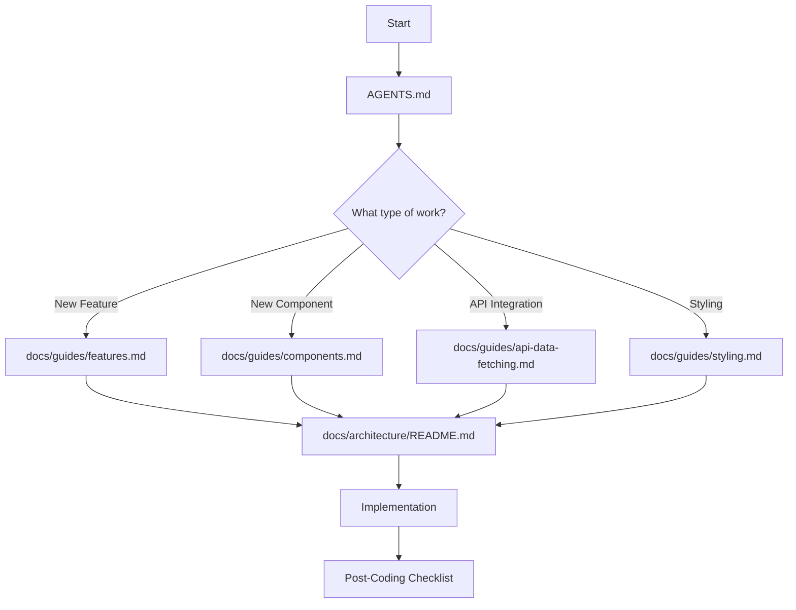

# Agent Instructions - Legacy Insight

> **Knowledge base for AI agents working on the Legacy Insight codebase.**

You are an AI assistant working on **Legacy Insight**, a centralized analytics platform. This project follows the **Hybrid Feature Scope Architecture (HFSA)**.

---

## 📚 Knowledge Flow

Before writing any code, consult these documents in order:



### Required Reading by Task Type

| Task Type         | Read First                         | Then                      |
| ----------------- | ---------------------------------- | ------------------------- |
| New Feature       | `docs/guides/features.md`          | `docs/architecture/`      |
| New Component     | `docs/guides/components.md`        | `src/components/shell/`   |
| API/Data Fetching | `docs/guides/api-data-fetching.md` | `src/libs/api/`           |
| Styling           | `docs/guides/styling.md`           | `reshaped.config.js`      |
| Testing           | `docs/guides/testing.md`           | Existing `spec.tsx` files |

---

## 🏗️ Project Core

| Technology | Details                              |
| ---------- | ------------------------------------ |
| Framework  | Next.js (App Router)                 |
| UI Library | Reshaped                             |
| Language   | TypeScript                           |
| Backend    | Strapi (separate project)            |
| Forms      | React Hook Form + Zod                |
| Data       | React Query (TanStack Query) + Axios |

### TypeScript Rules

- **ALWAYS** use `interface` for object definitions (Props, API responses)
- Use `type` **ONLY** for: Unions (`type Status = 'on' | 'off'`), Intersections, Primitives
- **NEVER** use inline types in component signatures

---

## 📁 Naming & Structure

### File/Folder Naming

```
✅ Correct: user-profile/, header.tsx, styles.module.scss
❌ Wrong:   UserProfile/, Header.tsx, style.module.scss
```

**Rule**: ALWAYS use lowercase with hyphens (kebab-case)

### Component Folder Structure

```
component-name/
├── index.tsx          # Main component (Orchestrator)
├── styles.module.scss # Styles (plural)
├── hooks.ts           # Logic/state (plural)
├── types.ts           # Interfaces
├── utils.ts           # Pure helpers
├── constants.ts       # Configuration
└── spec.tsx           # Tests
```

---

## 🎯 The Peak Component Pattern

Reference: `src/components/shell/`

1. **Orchestrator** — `index.tsx` consumes hooks, distributes props to sub-components
2. **Logic Separation** — 100% of state/effects live in `hooks.ts`
3. **Persistence** — Browser APIs (localStorage) go in `utils.ts`
4. **Sub-Components** — Large parts get their own folders with same pattern
5. **Strict Typing** — All props use `interface` in `types.ts`

---

## 🎨 Theme & Styling

- Use **Reshaped** design tokens
- Theme overrides: `src/styles/theme.scss`
- Global tokens: `src/styles/tokens.scss`
- **Always prefer CSS variables** over hardcoded values

---

## ✅ Post-Coding Checklist

After completing any code changes, **ALWAYS** run through this checklist:

### 1. Build Verification

```bash
# Type checking (REQUIRED)
npm run typecheck

# Linting (REQUIRED)
npm run lint

# Format check
npm run format
```

### 2. Testing

```bash
# Run tests
npm run test

# Run tests for specific feature
npm run test -- --filter="feature-name"
```

### 3. Development Server

```bash
# Start dev server and verify changes work
npm run dev
```

### 4. Documentation Updates

If your changes affect:

| Changed               | Update                             |
| --------------------- | ---------------------------------- |
| New feature           | `docs/guides/features.md`          |
| New component pattern | `docs/guides/components.md`        |
| API changes           | `docs/guides/api-data-fetching.md` |
| New dependencies      | `docs/guides/cli-commands.md`      |

---

## 🔄 Agent Workflow Summary

### Before Coding

1. Read `AGENTS.md` (this file)
2. Consult relevant guide from `docs/guides/`
3. Look at existing implementations for patterns

### After Coding

1. Run `npm run typecheck` — fix all TypeScript errors
2. Run `npm run lint` — fix all lint errors
3. Run `npm run test` — ensure tests pass
4. Verify with `npm run dev` — check UI works
5. Update documentation if needed

### Key Reference Files

| Purpose           | File                      |
| ----------------- | ------------------------- |
| API Services      | `src/libs/api/services/`  |
| React Query Hooks | `src/libs/api/hooks/`     |
| Feature Structure | `src/features/[feature]/` |
| Shell Pattern     | `src/components/shell/`   |
| Theme Config      | `reshaped.config.js`      |
| Global Styles     | `src/styles/`             |

---

## 🚫 Common Mistakes to Avoid

1. **Don't use camelCase for files/folders** — Use kebab-case only
2. **Don't put logic in components** — Move to `hooks.ts`
3. **Don't use inline types** — Define in `types.ts`
4. **Don't hardcode colors** — Use Reshaped tokens
5. **Don't skip typecheck** — Always run before committing
6. **Don't forget tests** — Create `spec.tsx` for new components
